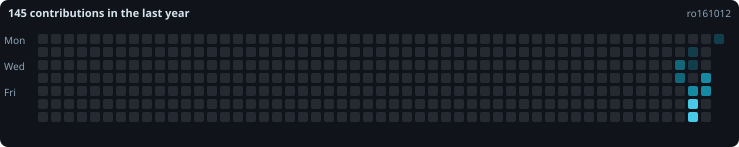

  <picture><source media="(prefers-color-scheme: light)" srcset="assets/profile-wordmark-light.svg" /></picture>

  <picture>
    <source media="(prefers-color-scheme: light)" srcset="assets/profile-hero-light.svg" />
    
  </picture>

<a href="https://github.com/ro161012">GitHub</a>

  <picture><source media="(prefers-color-scheme: light)" srcset="assets/profile-highlights-light.svg" /></picture>

## The year, so far

  <picture>
    <source media="(prefers-color-scheme: light)" srcset="assets/profile-heatmap-light.svg" />
    
  </picture>

## Signal

  <picture><source media="(prefers-color-scheme: light)" srcset="assets/profile-stats-light.svg" /></picture>

  <picture><source media="(prefers-color-scheme: light)" srcset="assets/profile-stack-light.svg" /></picture>

## Profile scan

  <picture><source media="(prefers-color-scheme: light)" srcset="assets/profile-system-scan-light.svg" /></picture>

